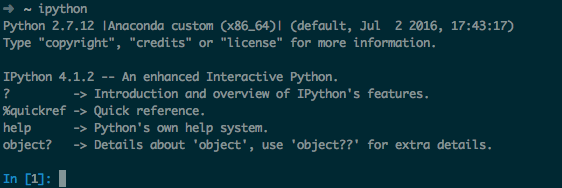

---
output:
  html_document: default
---

## Requisitos de python para el curso

Para el curso requieres los siguientes elementos:
- Editor
- Python Anaconda
- Terminal

Instalación de Python
========================================================

## Windows
- Es necesario instalar la herramienta de [Github desktop](https://desktop.github.com/).
- Requieres además instalar el [Editor Atom](http://atom.io).
- Descargar [Python Anaconda](https://www.continuum.io/downloads) selecciona la versión de acuerdo a tu sistema operativo.


Ubuntu
========================================================
- Descargar [Python Anaconda](https://www.continuum.io/downloads) puedes utilizar la terminal para instalarlo.
- Instalar [Editor Atom](http://atom.io).
- Abrir una terminal para probar que está correcto la variable $PATH.

```{bash eval=FALSE}
#En la terminal puedes probar lo siguiente

echo $PATH

#Debe aparecer algo similar a

echo /home/usuario/anaconda/bin
```

Ubuntu
========================================================
En caso de que no aparezca ```anaconda``` listado en la variable $PATH deberás incluir lo siguiente:
```{bash eval=FALSE}

export PATH=/home/usuario/anaconda2/bin:$PATH

```


Usando ipython
========================================================

Posteriormente deberás probar que ipython funcione:   



## Iniciamos con python
```{python}
# Declaramos una lista

lista = [3,54,23,45,767,34]
# Para saber la longitud

len(lista)

# Vamos a iterar sobre la lista

for i in range(len(lista)):
  print lista[i]

```

